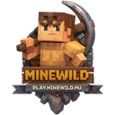

<p align="center">
  
</p>

<h1 align="center">MINEWILD</h1>

<p align="center">
  Saját belépési élményt adó, kliensoldali Fabric mod a <strong>MINEWILD</strong> szerverhez.
</p>

<p align="center">
  
  
  
  
</p>

## Mi Ez?

A `MINEWILD` nem egy klasszikus "teszünk még pár QoL funkciót a kliensbe" mod. Ez egy szerverre szabott bootstrapper, ami az első indítástól kezdve kontrollált és egységes játékosélményt rak össze:

- letölti a szükséges modokat Modrinthről
- opcionálisan beállítja a shader csomagot
- egységes kliensbeállításokat alkalmaz
- saját UI-elemeket és képernyőket ad a belépési folyamathoz
- automatikusan a `play.minewild.hu` szerverre irányít

Röviden: a cél egy "install, launch, play" élmény, minimális kézi állítgatással.

## Fő Funkciók

### Automatikus modtelepítés

A mod induláskor ellenőrzi a `mods` mappát, és ha hiányoznak a MINEWILD klienshez szükséges függőségek, Modrinthről letölti őket. Ha idegen modokat talál, restartot és szükség esetén törlést kér, hogy a kliens konzisztens maradjon.

### Shader workflow

Automatikusan kezeli a shader telepítést is:

- letölti a `Complementary Unbound` shader csomagot
- figyeli az `Euphoria Patches`-szel készült változatot
- első induláskor megkérdezi, hogy a shader legyen-e bekapcsolva
- beírja az Iris alapértelmezett beállításait

### Előre konfigurált kliens

A belépés előtt a mod több alapbeállítást is egységesít, többek között:

- magyar nyelv
- GUI scale
- view distance és simulation distance
- zene kikapcsolása
- VSync kikapcsolása
- csökkentett részecskeeffektek
- mipmap és néhány Sodium minőségi opció finomhangolása

### Saját MINEWILD UX

A projekt több kliensképernyőt és gombkiosztást is átír:

- egyedi splash és logó
- egyedi restart / shader választó képernyő
- auto-connect a `play.minewild.hu` szerverre
- testreszabott pause menü
- gyors linkek a webáruházhoz, weboldalhoz, Discordhoz és supporthoz
- átdolgozott disconnect / reconnect / kilépés folyamat

## Támogatott Környezet

- Minecraft: `1.20.1` - `1.21.11`
- Fabric Loader: `>= 0.18.4`
- Környezet: `client`
- Build target: `Java 17`

## Fejlesztői Indítás

### 1. Klónozás

```powershell
git clone https://github.com/MINEWILDHU/MINEWILD-Mod.git
cd MINEWILD-Mod
```

### 2. Java ellenőrzés

A repo jelenleg tartalmaz egy gépfüggő Gradle beállítást:

```properties
org.gradle.java.home=C:/Program Files/JetBrains/IntelliJ IDEA 2025.3.2/jbr
```

Másik gépen ezt vagy állítsd át a saját JDK/JBR elérési utadra, vagy távolítsd el a `gradle.properties` fájlból, különben a build el fog hasalni.

### 3. Build

```powershell
.\gradlew.bat build
```

### 4. Fejlesztői kliens indítás

```powershell
.\gradlew.bat runClient
```

## Projektstruktúra

- `src/main/java/hu/ColorsASD/minewild/installer` - mod- és shader-telepítés, Modrinth integráció
- `src/main/java/hu/ColorsASD/minewild/prelaunch` - indulás előtti config módosítások
- `src/client/java/hu/ColorsASD/minewild/client` - klienslogika, képernyők, autoconnect, UI helper osztályok
- `src/client/java/hu/ColorsASD/minewild/mixin/client` - Minecraft UI és kliensfolyamat mixinek
- `src/main/resources` - mod metaadat, ikonok, GUI textúrák

## Megjegyzések

- Az első indításnál internetkapcsolat kell, mert a szükséges modok és shader csomagok letöltése online történik.
- Ez a projekt kifejezetten a MINEWILD szerver élményére van optimalizálva, nem általános célú modpack manager.
- A mod kliensoldali, szerveroldali telepítést nem igényel.

## Licenc

`All Rights Reserved`

Részletek: [LICENSE.txt](LICENSE.txt)
